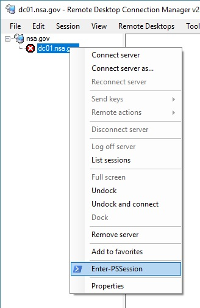

# Plugins for Remote Desktop Connection Manager #

Remote Desktop Connection Manager 2.7 (maybe earlier?) contains undocumented support for plugins. This is an attempt to document this functionality.

Plugins are C# dlls (.NET 4.0?) which export a class implementing IPlugin interface. Add `C:\Program Files (x86)\Microsoft\Remote Desktop Connection Manager\RDCMan.exe` to your project references.

## Loading ##

For a plugin to be loaded the dll must be placed in the same folder as `RDCMan.exe` and it must be called `Plugin.*.dll`. For more info see `RdcMan.Program.InstantiatePlugins()` inside of `RDCMan.exe`

## IPlugin interface ##

Plugins implement the `IPlugin` interface which has these callbacks: 
- OnContextMenu - called when the user right clicks a server node in the tree
- OnDockServer - ...
- OnUndockServer - ...
- PostLoad - called after plugins and the connection tree is loaded
- PreLoad - called while the plugins are loading
- SaveSettings - user clicked OK in the Options dialog
- Shutdown - RDCMan is shutting down

## Plugin.Sample ##
A plugin skeleton. Place the compiled dll in the same folder as RDCMan.exe

## Plugin.EnterPSSession ##

## References

Thanks to:
- [RDCManPlugins](https://github.com/Tadas/RDCManPlugins.git)
- [ILSpy](https://github.com/icsharpcode/ILSpy/releases) an open-source .NET assembly browser and decompiler.

See also:
- [RDCMan](https://github.com/lzpong/RDCMan.git)
- [RdcManPluginFix](https://github.com/Geosong/RdcManPluginFix.git)
